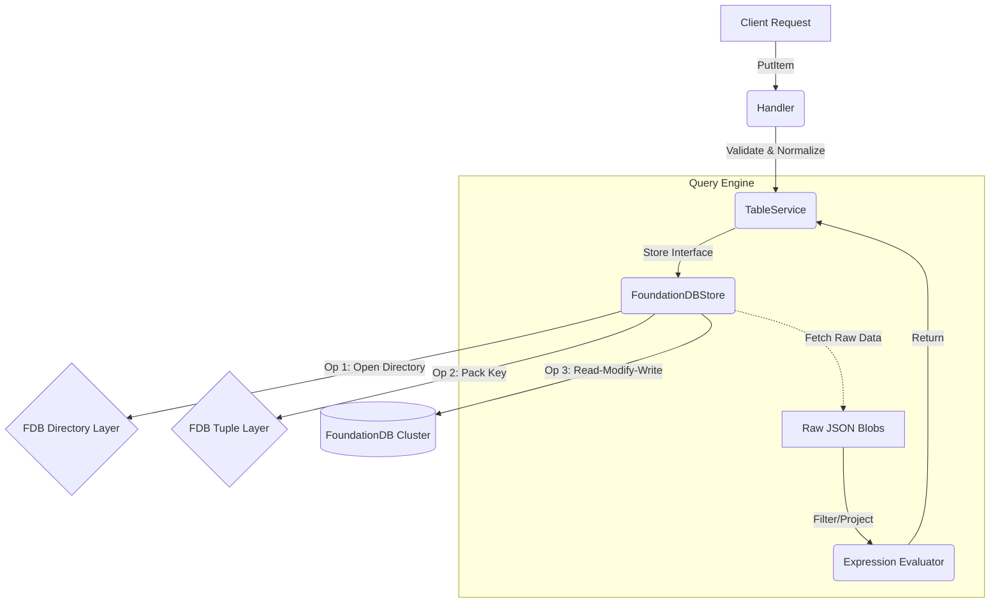

# ConcreteDB Project Documentation

## TL;DR Summary
ConcreteDB is a high-performance, DynamoDB-compatible database implemented on top of **FoundationDB**. It provides a drop-in replacement for DynamoDB workloads, translating standard DynamoDB JSON-based requests into strict FoundationDB Key-Value transactions.

## Key Dependencies & Concepts
*   **FoundationDB (FDB)**: The backing distributed key-value store. Its ACID transactions are the foundation of ConcreteDB's correctness.
*   **FDB Directory Layer**: Heavily used to manage namespaces for Tables and Indexes, automatically handling prefix allocation.
*   **FDB Tuples**: FDB's standard way of encoding rich data types (Strings, Integers, UUIDs) into byte keys that preserve sort order.
*   **DynamoDB JSON Format**: The system natively speaks the `{ "S": "some string" }` attribute value format defined in `apps/concretedb/models`.

## Architecture & Data Flow
Requests follow a standard 3-tier flow:
1.  **API/Handler Layer**: Unmarshals HTTP/RPC requests.
2.  **Service Layer (`service/`)**: "The Controller". Orchestrates business logic, validates constraints (e.g., "KeySchema missing"), and calls the Store.
3.  **Store Layer (`store/`)**: "The Model". Translates strict Go structs into FDB transactions.



## Critical Implementation Details

### Load Bearing Code
*   **`store/foundationdb_store.go`**: This is the monolithic core. It manages the lifecycle of FDB transactions.
    *   **Data Storage**: Items are stored as **JSON Blobs** at `(tables, <TableName>, data, <PartitionKey>, [<SortKey>])`.
    *   **Indexing**: GSIs are distinct sub-directories `(tables, <TableName>, index, <IndexName>)`. Keys in indexes are packed tuples of the *Indexed Attribute* + *Primary Key*.
*   **`service/table_service.go`**: Validations for DynamoDB rules (e.g., Attribute definitions matching KeySchema) happen here.
*   **`expression/` Module**: Since FDB is a KV store, it cannot "Filter by Age > 10" server-side. ConcreteDB pulls the range of data and filters it **in-memory** using this module.

### Design Decisions (Why we did this)
*   **JSON Blobs for Values**: Instead of shredding every attribute into a KV pair, we store the full Item as a single JSON blob.
    *   *Pros*: Simplicity (schema-less support is essentially free), cheaper reads (1 key fetch = full item).
    *   *Cons*: Partial updates (`UpdateItem SET a=1`) require a Read-Modify-Write cycle.
*   **Directory Layer**: We use FDB's Directory Layer to map human-readable table names to short byte prefixes. This allows cheap table renaming and deletions.

### ⚠️ Edge Cases & Technical Debt
*   **FDB Value Size Limit**: FoundationDB has a strict **100KB** limit per value. DynamoDB allows **400KB**. Since we store items as single blobs without chunking, **items >100KB will fail** at the FDB layer.
*   **Scan Performance**: A `Scan` operation reads *every* key in the table's directory. For large tables, this will be slow and network-heavy as filtering happens in the application layer, not the storage layer.
*   **Consistency**: `ConsistentRead: true` is practically native to FDB (Snapshot Reads vs Serializble Reads). However, be aware that `Query`/`Scan` paginators rely on `LastEvaluatedKey` which is constructed manually after the read limit is hit.

## Setup/Usage Example
Instantiating the core stack:

```go
package main

import (
	"context"
	"log"
	
	"github.com/apple/foundationdb/bindings/go/src/fdb"
	"apps/concretedb/store"
	"apps/concretedb/service"
	"apps/concretedb/models"
)

func main() {
	// 1. Connect to FDB Cluster
	fdb.MustAPIVersion(710)
	db := fdb.MustOpenDefault()

	// 2. Initialize Store
	fdbStore := store.NewFoundationDBStore(db)

	// 3. Initialize Service
	svc := service.NewTableService(fdbStore)

	// 4. Use Service
	ctx := context.Background()
	_, err := svc.CreateTable(ctx, &models.Table{
		TableName: "Users",
		KeySchema: []models.KeySchemaElement{
			{AttributeName: "UserID", KeyType: "HASH"},
		},
		AttributeDefinitions: []models.AttributeDefinition{
			{AttributeName: "UserID", AttributeType: "S"},
		},
	})
	if err != nil {
		log.Printf("Create table failed (or exists): %v", err)
	}
}
```
