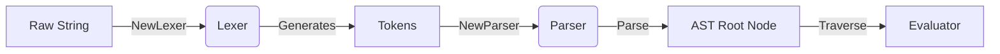

# Expression Module Documentation

## TL;DR Summary
This module implements a custom parser and lexer for DynamoDB-style conditional expressions. It converts raw string expressions into an Abstract Syntax Tree (AST) that can be evaluated against database records.

## Key Dependencies & Concepts
*   **State Machine Lexing**: Uses a state-function based approach (standard Go pattern) for tokenization, allowing flexible context switching during lexing.
*   **Recursive Descent Parsing**: Implements a standard top-down parser to handle operator precedence and nested expressions.
*   **Abstract Syntax Tree (AST)**: Defines a type-safe tree structure (`BinaryNode`, `FunctionNode`, `PathNode`) representing the parsed logic.

## Architecture & Data Flow
Raw strings enter the **Lexer**, which consumes runes and emits **Tokens**. The **Parser** consumes these tokens to build a hierarchical **AST**. This AST is later consumed by an Evaluator to test records.



## Critical Implementation Details
### Load Bearing Code
*   **`lexer.go:lexText`**: The main loop of the state machine. It decides which state function to transition to based on the next rune.
*   **`parser.go:parseCondition`**: The core logic for parsing comparison operators, function calls (`attribute_exists`), and precedence handling.
*   **`parser.go:parsePath`**: Handles complex document paths including dot notation (`info.rating`) and list indexing (`[1]`).

### Design Choices
*   **Custom Lexer**: Chosen over `text/scanner` to correctly handle DynamoDB-specific tokens like `:value` placeholders and `#name` substitutions.
*   **Recursive Descent**: Selected for ease of debugging and extending support for new DynamoDB functions without complex parser generator configurations.
*   **Interface-based Nodes**: The `Node` interface allows the AST to be polymorphic, simplifying traversal and evaluation logic.

### Edge Cases & Gotchas
*   **Keywords as Identifiers**: The lexer eagerly classifies keywords. The parser must check context to determine if a token is a keyword or a valid attribute name.
*   **Operator Precedence**: `OR` has lower precedence than `AND`, which is lower than `NOT`. Parentheses strictly override this.
*   **BETWEEN Operator**: Handled as a special 3-argument function node `BETWEEN(path, lower, upper)` internally to simplify the `BinaryNode` structure.

## Setup/Usage Example
```go
package main

import (
	"fmt"
	"apps/concretedb/expression"
)

func main() {
	// 1. Lex the input string
	input := "#s = :status AND age > :min_age"
	l := expression.NewLexer(input)
    // Lexer runs immediately in constructor and populates l.tokens

	// 2. Parse tokens into AST
    // Note: In strict usage, you might need to access tokens via a helper if unexported;
    // assuming internal package access or updated export:
	p := expression.NewParser(l.tokens) 
    
	expr, err := p.Parse()
	if err != nil {
		panic(err)
	}

	// 3. Result
	fmt.Printf("AST: %s\n", expr)
}
```

> ⚠️ **Note**: The `lexer.go` defines `tokens` as unexported.
