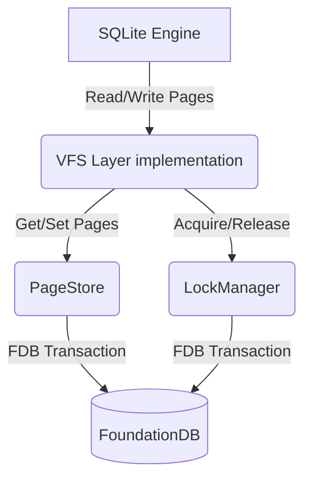

# ConcreteSQL Code Walkthrough & Architecture Guide

This document provides a deep dive into the `concretesql` codebase. It explains *how* we map SQLite to FoundationDB, the critical distributed systems problems we solved (AA/ABA/Isolation), and the specific code paths that implement them.

## 1. High-Level Architecture

**ConcreteSQL** is a "Serverless SQLite" implementation. It allows multiple stateless SQLite clients (e.g., web servers, cloud functions) to share a single coherent database stored in **FoundationDB (FDB)**.

### The Stack
1.  **SQLite (Application)**: Thinks it is writing to a normal file `test.db`.
2.  **SQLite VFS (Virtual File System)**: Our Go code intercepts file I/O calls (`Read`, `Write`, `Lock`, `Sync`).
3.  **Page Store (FDB Adapter)**: Maps SQLite pages (default 4KB, but dynamic) to FDB Keys.
4.  **FoundationDB**: The distributed Key-Value store proving ACID guarantees.



---

## 2. Core Components

### A. The VFS Layer (`vfs/`)
**File**: [vfs/file.go](file:///config/kiroku-core/apps/concretesql/vfs/file.go) (Lines 1-350)
This acts as the translation layer.

*   **`Open`**: Initializes a `PageStore` and `LockManager` for the file.
*   **`FileControl`** (Line ~344): We recently added this to intercept `PRAGMA concrete_request_id`. This allows the SQL user to pass metadata (Request IDs) down to the storage layer without changing method signatures in the standard driver.
*   **`Lock`/`Unlock`** (Line ~314): Calls our distributed lock manager. Crucially, in `Lock()`, we now pass the `baseVersion`. This tells the system *which snapshot* of the database this connection is reading, protecting it from being garbage collected.
*   **`Sync`** (Line ~282): This is the "Commit" point. It calls `ps.SetVersionAndSize`. Note that we pass the `requestID` here to enable Idempotency.

### B. The Page Store (`store/pager.go`)
**File**: [store/pager.go](file:///config/kiroku-core/apps/concretesql/store/pager.go)
This manages the data storage format.

#### Data Model (Key-Value Structure)
We use a **Tuple** structure for keys to keep data organized within a specific directory prefix.
*   `("meta", "version")` -> `[8 bytes int64]`: The current "Head" version of the DB.
*   `("data", PageID, VersionID)` -> `[4096 bytes]`: A specific historical version of a page.
*   `("tx_map", RequestID)` -> `[Expiry Time]`: Idempotency keys.

#### Key Functions
1.  **`ReadPage(snapshotVersion, pageID)`** (Line ~154):
    To read Page 1 at Version 100:
    *   It scans the Key Range `("data", 1, 0)` to `("data", 1, 101)`.
    *   It selects the *largest* version in that range (Reverse Limit 1).
    *   This gives us the standard "Snapshot Isolation" behavior.

2.  **`SetVersionAndSize`** (Line ~68):
    Atomic Commit Logic.
    *   **Idempotency Check**: Checks `tx_map`. If `RequestID` exists, return "Success" immediately (No-Op).
    *   **ABA Protection**: Reads current DB Version. If it doesn't match `baseVersion` (what the client started with), it fails with `conflict`. This prevents "blind overwrites".
    *   **Commit**: Updates `("meta", "version")` and writes the `tx_map` entry.

3.  **`Vacuum`** (Line ~250):
    Garbage Collection.
    *   **Ghost Read Protection**: It first scans `("locks", "shared")` to find `minActiveVersion`.
    *   It deletes a page version `V` only if there is a newer version `V_new` such that `V_new <= minActiveVersion`.
    *   This guarantees that any active reader (who sees `minActiveVersion` or higher) still has access to the page history they need.

### C. The Distributed Lock Manager (`store/lock.go`)
**File**: [store/lock.go](file:///config/kiroku-core/apps/concretesql/store/lock.go)
Implements the SQLite Locking Protocol (Shared -> Reserved -> Pending -> Exclusive) over FDB.

*   **Heartbeats**: Locks have a 5-second lease. A background goroutine (`startHeartbeat`, Line ~116) refreshes the TTL every 2 seconds.
*   **Shared Lock Versioning** (Line ~247): When acquiring a Shared Lock, we now store `[Expiry][SnapshotVersion]`.
    *   Current: `Lock` takes `snapshotVersion`.
    *   Storage: `val[8:16]` stores the version.
    *   This is the "secret sauce" that allows `Vacuum` to see what readers are doing.

---

## 3. Distributed Safety Mechanisms Explored

### The "Self-Sabotage" Fix (Idempotency)
**Problem**: An HTTP request retries a transaction. The first one succeeded but the response was lost. The retry applies the same change again (Double Spend).
**Code Solution**:
In `store/pager.go`:
```go
// 1. Idempotency Check
if requestID != "" {
    ik := ps.subspace.Pack(tuple.Tuple{"tx_map", requestID})
    if tr.Get(ik).Present() { return nil } // Treat as Success
}
```
**Usage**: The client must run `PRAGMA concrete_request_id = 'UUID'` before commit.

### The "Unknown Outcome" Fix (ABA Protection)
**Problem**: Client reads Version 10. Network lag. Version becomes 11, then 10 again (ABA), or just 11. Client writes based on V10 data, overwriting V11 updates.
**Code Solution**:
In `store/pager.go`:
```go
if currentVersion != baseVersion {
    return errors.New("conflict: database version changed")
}
```
We force strict serialization. If the DB changed underneath you, you *must* restart.

### The "Ghost Read" Fix (Isolation)
**Problem**: `Vacuum` deletes old pages to save space. A slow reader looking at Version 100 tries to read Page 5, but Vacuum deleted Page 5 (V100) because Page 5 (V102) exists.
**Code Solution**:
1.  **Reader**: "I am reading Version 100" -> Stored in Lock.
2.  **Vacuum**: "Who is reading?" -> Sees Version 100.
3.  **Vacuum**: "I see Page 5 (V100) and Page 5 (V102). Can I delete V100? No, because 102 > ReaderVersion(100). Reader needs V100."

---

## 4. Design Decisions & Trade-offs

| Decision | Why? | Trade-off |
| :--- | :--- | :--- |
| **FoundationDB** | Provides true ACID transactions and high throughput. | Complexity in setup/dependencies compared to S3/Blob. |
| **Append-Only Pages** | Simplifies Snapshot Isolation. Readers don't block writers. | Requires `Vacuum` to reclaim space. Higher storage cost initially. |
| **Optimistic Locking (ABA)** | We prefer failing a transaction over locking the entire DB for duration of thinking. | High contention workloads might see many retries. |
| **VFS-Level Logic** | Transparent to SQLite. No SQL parsing required. | We rely on PRAGMAs for metadata injection. |

## 5. Entry Points for Review
If you want to read the code yourself, start here:
1.  **Data Write Path**: `vfs.Sync` -> `ps.WritePages` -> `ps.SetVersionAndSize`.
2.  **Data Read Path**: `vfs.ReadAt` -> `ps.ReadPage`.
3.  **Locking**: `vfs.Lock` -> `lm.Lock` -> `lm.tryLock`.

---

## 6. Configuration

The system uses a `store.Config` struct to parameterize key behaviors. These can be adjusted via the `vfs.Register` call.

| Parameter | Default | Description |
| :--- | :--- | :--- |
| `PageSize` | 4096 | Default page size for *new* databases. Existing DBs use their own. |
| `MaxTxBytes` | 9MB | Max size of a single FDB transaction. Large writes are split. |
| `LockLeaseDuration` | 5s | Distributed lock TTL. If client crashes, lock expires after this. |
| `LockHeartbeatInterval` | 2s | How often we refresh the lease. |
| `LockPollInterval` | 50ms | How often we check for lock availability when blocked. |
